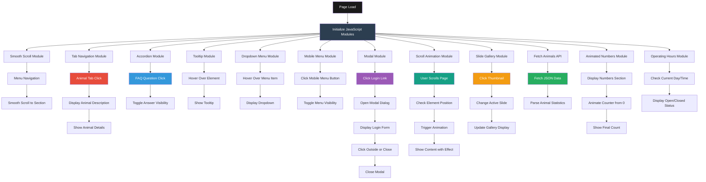

# Animais Nordestinos

An interactive and educational web application showcasing the wildlife of Northeastern Brazil. This project features advanced JavaScript modules, dynamic content loading, and modern web development practices to create an engaging user experience for learning about endangered and native species from the region.

## Description

Animais Nordestinos (Northeastern Animals) is a comprehensive single-page application that presents detailed information about six iconic animal species from Northeastern Brazil: Lear's Macaw, Golden-headed Lion Tamarin, Harpy Eagle, Margay Cat, Common Marmoset, and Hoary Fox. The project combines educational content with interactive features including tabbed navigation, image galleries, animated statistics, and smooth scrolling effects.

Built with vanilla JavaScript and organized into modular components, the application demonstrates modern web development techniques including ES6+ features, Webpack bundling, API integration, and responsive design principles. The project serves both as an educational resource about regional biodiversity and as a showcase of advanced front-end development practices.

## Features

- **Interactive Tab Navigation**: Click-based animal selection with dynamic content display
- **Custom Image Slider**: Gallery with thumbnail navigation and smooth transitions
- **Accordion FAQ Section**: Expandable questions and answers about the animals
- **Animated Statistics**: Counter animations for population numbers fetched from API
- **Modal Login System**: Accessible modal dialog with form validation
- **Dropdown Menu**: Multi-level navigation with hover and click interactions
- **Mobile Menu**: Responsive hamburger menu for mobile devices
- **Smooth Scroll**: Animated navigation between page sections
- **Scroll Animations**: Content reveals on scroll with different animation directions
- **Tooltip System**: Contextual information on hover
- **API Integration**: Dynamic data fetching for animal statistics
- **Responsive Design**: Fully adaptive layout for all screen sizes
- **Operating Hours Display**: Dynamic business hours calculation

## Technologies Used

- **JavaScript ES6+**: Modern JavaScript with classes, modules, and async/await
- **Webpack**: Module bundler for production optimization
- **Babel**: JavaScript transpiler for browser compatibility
- **ESLint**: Code quality and style enforcement (Airbnb config)
- **HTML5**: Semantic markup with accessibility features
- **CSS3**: Advanced styling with Grid, Flexbox, and animations
- **Fetch API**: Asynchronous data loading
- **JSON**: Data storage and API responses

## Main Application Flow



## Project Structure

```
animaisNordestinos/
├── index.html                    # Main HTML file
├── package.json                  # NPM dependencies and scripts
├── webpack.config.js             # Webpack configuration
├── .eslintrc.json               # ESLint configuration
├── animaisapi.json              # Animal statistics API data
├── main.js                      # Compiled/bundled JavaScript
├── css/                         # Stylesheets
│   ├── style.css               # Main styles
│   ├── geral.css               # General styles
│   ├── dropdown-menu.css       # Dropdown styles
│   ├── menu-mobile.css         # Mobile menu styles
│   ├── modal.css               # Modal dialog styles
│   ├── numeros.css             # Statistics section styles
│   ├── slide.css               # Gallery slider styles
│   └── tooltip.css             # Tooltip styles
├── js/                          # JavaScript modules
│   ├── script.js               # Main entry point
│   └── modules/                # Feature modules
│       ├── accordion.js        # FAQ accordion
│       ├── anima-numeros.js    # Number animations
│       ├── debounce.js         # Debounce utility
│       ├── dropdown-menu.js    # Dropdown navigation
│       ├── fetch-animais.js    # Animal data fetching
│       ├── fetch-bitcoin.js    # Bitcoin price fetching
│       ├── funcionamento.js    # Operating hours
│       ├── menu-mobile.js      # Mobile menu toggle
│       ├── modal.js            # Modal dialog
│       ├── outsideclick.js     # Outside click detection
│       ├── scroll-anima.js     # Scroll animations
│       ├── scroll-suave.js     # Smooth scrolling
│       ├── slide.js            # Image slider
│       ├── tabnav.js           # Tab navigation
│       └── tooltip.js          # Tooltip system
└── img/                         # Images and icons
    ├── ft1.png - ft6.png       # Animal thumbnails
    ├── imagem1.jpg - imagem6.jpg # Animal images
    ├── slide/                   # Gallery images
    ├── arrow.svg               # Navigation arrows
    ├── fechar.svg              # Close icon
    └── mapa.png                # Location map
```

## Featured Animals

The application showcases six species native to Northeastern Brazil:

1. **Lear's Macaw** (Anodorhynchus leari) - Endangered blue macaw from the Caatinga
2. **Golden-headed Lion Tamarin** (Leontopithecus chrysomelas) - Atlantic Forest primate
3. **Harpy Eagle** (Harpia harpyja) - One of the world's largest eagles
4. **Margay Cat** (Leopardus wiedii) - Agile wild cat adapted to various ecosystems
5. **Common Marmoset** (Callithrix jacchus) - Small primate with distinctive white ear tufts
6. **Hoary Fox** (Lycalopex vetulus) - Canid adapted to semi-arid regions

## JavaScript Modules

### Core Functionality

- **TabNav**: Manages tabbed interface for animal selection
- **Accordion**: Handles expandable FAQ sections
- **Modal**: Controls login modal dialog with accessibility features
- **Slide**: Custom image gallery with navigation controls
- **ScrollSuave**: Implements smooth scrolling between sections
- **ScrollAnima**: Triggers animations when elements enter viewport

### Interactive Features

- **DropdownMenu**: Multi-level navigation menu system
- **MenuMobile**: Responsive mobile menu with toggle
- **Tooltip**: Contextual information display on hover
- **AnimaNumeros**: Animated counter for statistics

### Data Management

- **FetchAnimais**: Loads animal statistics from JSON API
- **FetchBitcoin**: Retrieves cryptocurrency prices
- **Funcionamento**: Calculates and displays operating hours

### Utilities

- **Debounce**: Performance optimization for event handlers
- **OutsideClick**: Detects clicks outside elements for closing menus/modals

## Responsive Design

The application is fully responsive with breakpoints for:

- **Mobile**: < 700px - Single column layout, hamburger menu
- **Tablet**: 700px - 1200px - Adjusted grid, optimized spacing
- **Desktop**: > 1200px - Full multi-column layout with sidebar

## API Endpoints

The application fetches data from:

- `animaisapi.json` - Local JSON file with animal population statistics
- External APIs can be integrated for real-time data

## Accessibility Features

- Semantic HTML5 elements
- ARIA labels and attributes
- Keyboard navigation support
- Focus management in modals
- Screen reader friendly content
- Alt text for all images

## Performance Optimizations

- Debounced scroll events
- Lazy loading of content
- Optimized animations with CSS transforms
- Webpack code splitting and minification
- Efficient DOM manipulation

## Educational Content

The site provides information about:

- Species characteristics and behavior
- Conservation status and threats
- Habitat and geographical distribution
- Lifespan and diet
- Ecological importance
- Protection measures

## Author

**Luiz Augusto Oliveira**

- Location: Campina Grande - PB, Brazil
---

This project was developed as a demonstration of modern JavaScript development practices, modular architecture, and interactive web design while promoting awareness about Northeastern Brazil's wildlife conservation.
